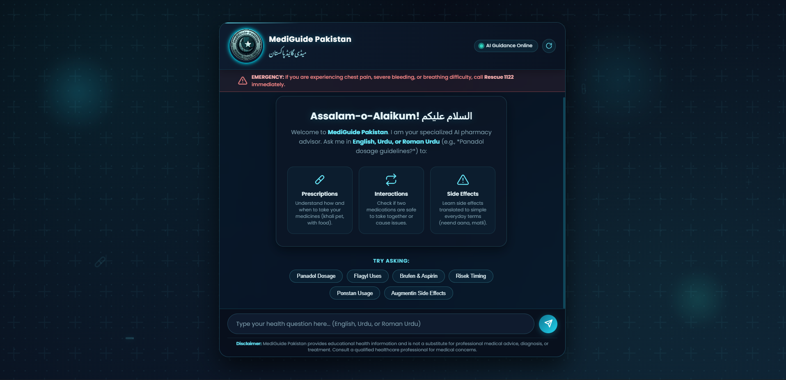
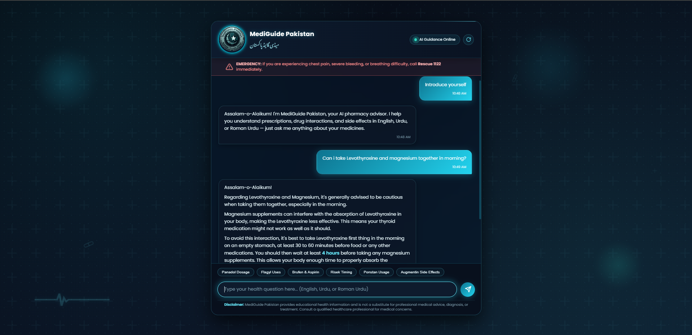
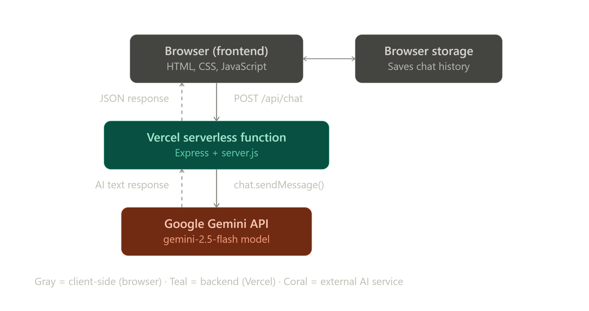

# MediGuide Pakistan (میڈی گائیڈ پاکستان)

### Know. Trust. Heal.

A free AI-powered medication guidance assistant for Pakistani patients and caregivers.

**Live App:** [mediguide-pk.vercel.app](https://mediguide-pk.vercel.app)
**Demo Video:** [https://youtu.be/oaCMFvhOP8U]
**Built by:** Dr. Waayna Rauf, Doctor of Pharmacy, Pakistan

---

## The Problem

Millions of Pakistani patients receive prescriptions they cannot fully understand. They are often unaware of what their medicines are for, when to take them, what side effects to expect, or how their medicines interact with one another. This gap in understanding contributes to incorrect medication use and, in many cases, patients abandoning treatment altogether.

Two real cases motivated this project. In one, a patient was prescribed Levothyroxine and Magnesium to be taken together every morning, with no explanation that Magnesium interferes with Levothyroxine absorption when taken at the same time — rendering the treatment ineffective. In another, a patient stopped taking Orlistat without informing her doctor because she was never told that oily stools were an expected, manageable side effect.

These are not isolated incidents. They reflect a broader, everyday gap between prescribing and understanding — one that directly affects treatment outcomes across Pakistan.

## The Solution

MediGuide Pakistan is a free, AI-powered medication guidance assistant that helps patients and caregivers:

- Understand their prescriptions in plain language
- Check interactions between medications
- Learn about side effects before they occur
- Get answers in English, Urdu, or Roman Urdu
- Access reliable guidance at no cost, on any device, at any time

No app download or medical background is required.

---

## Key Features

- **Bilingual support** — understands and responds in English, Urdu script, or Roman Urdu, including mixed "Urdish" input.
- **Urdu text rendering** — automatically detects Urdu script and renders it right-to-left using the Noto Nastaliq Urdu font.
- **Pakistani brand recognition** — maps common local brand names (Panadol, Calpol, Brufen, Ponstan, Flagyl, Augmentin, Risek, Arinac, Surbex-Z) to their active ingredients and clinical use.
- **Automatic retry handling** — if the Gemini API encounters a temporary connection issue, the server retries up to three times before surfacing an error, improving reliability during conversation.
- **Safety messaging** — a Rescue 1122 emergency banner and a persistent medical disclaimer are shown at all times.
- **Secure key management** — all API calls are routed through the Express.js backend; the Gemini API key is never exposed to the browser.

---

## Screenshots


*The MediGuide Pakistan welcome screen, showing the emergency banner, bilingual interface, and quick-start suggestions.*


*MediGuide Pakistan responding to a medication query, demonstrating language detection and clear, simple guidance.*

---

## Architecture



The browser frontend (HTML, CSS, JavaScript) communicates with a Vercel serverless function running an Express backend (`server.js`), which in turn calls the Google Gemini API (`gemini-2.5-flash`) and returns the formatted response. Chat history is preserved in browser storage for session continuity.

---

## Course Concepts Demonstrated

This project was built for the Google Kaggle 5-Day AI Agents Intensive Vibe Coding Capstone, and demonstrates the following course concepts:

| Concept | How It's Demonstrated |
|---|---|
| **AI Agent** | Google Gemini API powers conversational responses, guided by a custom system instruction for medical guidance |
| **Antigravity (Vibe Coding)** | The frontend, backend, and styling were built using Google Antigravity, by describing requirements in natural language |
| **Deployability** | Deployed to production on Vercel and publicly accessible at no cost |
| **Security** | API keys are stored in environment variables, never exposed client-side, and excluded from version control via `.gitignore` |

---

## Prerequisites

- Node.js (v18 or higher) — [nodejs.org](https://nodejs.org)
- A Google Gemini API key — [Google AI Studio](https://aistudio.google.com/app/apikey)

---

## Running Locally

```bash
# 1. Navigate to the project folder
cd MediGuide-pk

# 2. Install dependencies
npm install

# 3. Create your environment file
cp .env.example .env
```

Open `.env` and add your API key:

```
GEMINI_API_KEY=your_actual_key_here
PORT=3000
```

```bash
# 4. Start the server
npm start
```

The app will be available at `http://localhost:3000`.

---

## Deployment (Vercel)

This project includes a `vercel.json` configuration for automatic serverless deployment.

1. Push the repository to GitHub (the `.gitignore` file excludes `.env` automatically).
2. Sign in to [Vercel](https://vercel.com) with GitHub and import the repository.
3. Under **Environment Variables**, add `GEMINI_API_KEY` with your actual key.
4. Click **Deploy**. Vercel will build and provide a public URL within a couple of minutes.

---

## Testing Checklist

- Responsive layout verified on mobile and desktop viewports
- English query tested (e.g. *"Can you explain the side effects of Augmentin?"*)
- Roman Urdu query tested (e.g. *"Flagyl kab leni chahiye?"*)
- Urdu script query tested, confirming correct right-to-left rendering
- Emergency banner and disclaimer visible on all screen sizes
- Graceful error handling confirmed when the API is unreachable

---

## Future Plans

- Expanding the Pakistani medicine database with additional local brand names
- A dedicated mobile app (iOS and Android)
- Voice input support for low-literacy users
- Integration with pharmacy locator services
- Ongoing improvements based on real patient feedback

---

## Disclaimer

MediGuide Pakistan provides educational health information and is not a substitute for professional medical advice, diagnosis, or treatment. Always consult a qualified healthcare professional for medical concerns. In emergencies, call **Rescue 1122** immediately.

---

## Kaggle Capstone Submission Checklist

- [ ] Local server runs successfully on `http://localhost:3000`
- [ ] Code pushed to GitHub (excluding `.env`)
- [ ] Deployed live on Vercel with `GEMINI_API_KEY` configured
- [ ] Verified chat in English, Roman Urdu, and Urdu script
- [ ] Confirmed emergency banner and disclaimer display correctly on desktop and mobile
- [ ] Vercel URL included in final Kaggle Capstone submission

---

**Built for the Google Kaggle 5-Day AI Agents: Intensive Vibe Coding Capstone Project — Agents for Good track.**

**Technologies:** Google Antigravity · Google Gemini API · Node.js · Express.js · Vercel
